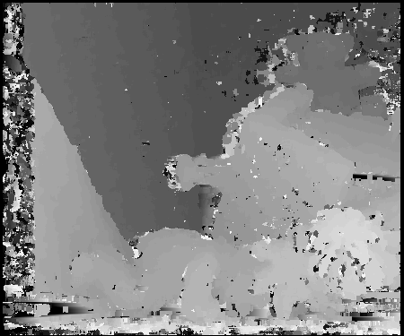
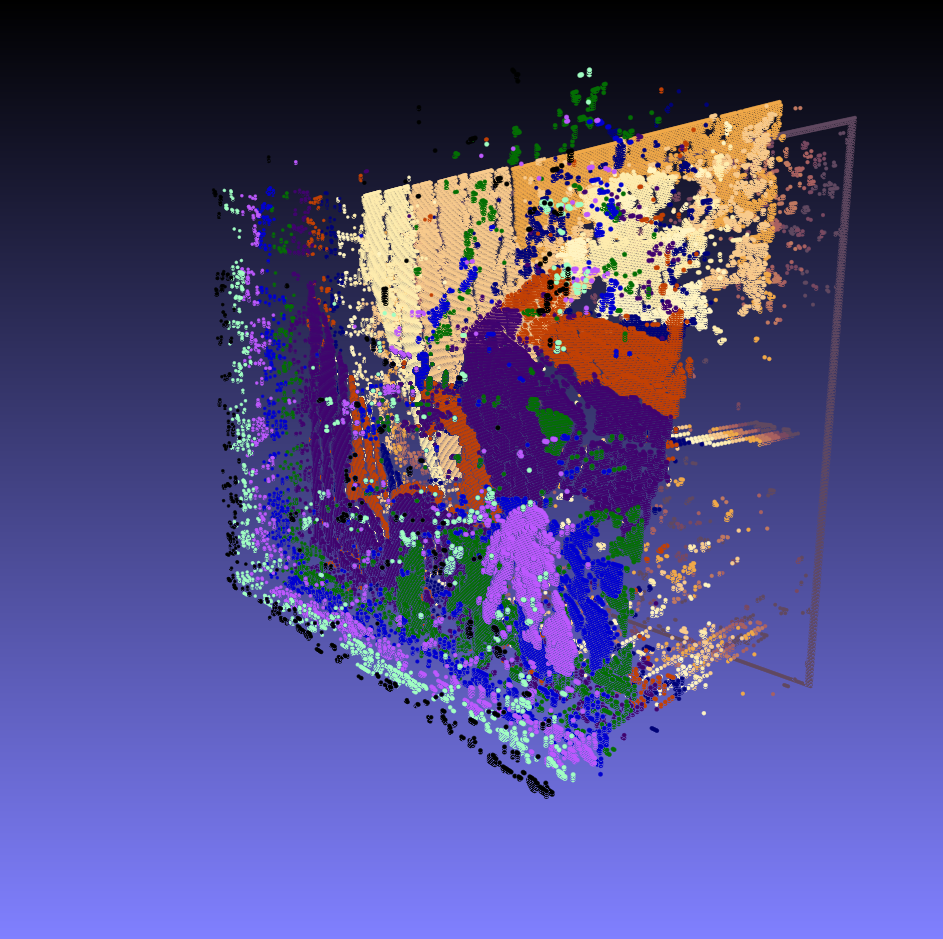

# Stereo Matching

The class ssd performs a stereo matching on two images which results in a depth map as greyscale image.
For parallelization parallel algorithms from the STL C++17 is used.

This image is taken and a point cloud is created based on the greyscale values. The final ply file is written to disk.
An artificial colorization is applied based on the depth value of the point cloud.

usage:
```
stereom --left=im1.png --right=im2.png --out=output
```

some results:

| left image| right image |
|---|---|
|||

depth image:



point cloud data:

